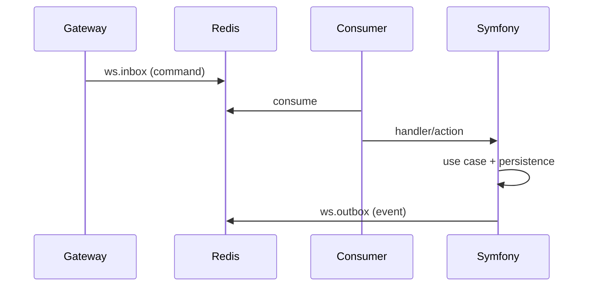

# Backend Architecture (Symfony)

## Scope
Symfony handles **authoritative domain logic** and **persistence**. It consumes realtime commands from `ws.inbox` and publishes authoritative events to `ws.outbox` and `ws.events`.

## Key Responsibilities
- Validate and authorize commands.
- Persist domain state in MySQL.
- Publish authoritative events back to clients.
- Enforce membership and access rules.

## High-Level Command Handling

## Realtime Handlers
- Handlers map command types to actions.
- Actions validate payloads and call services.
- Services perform domain logic and persistence.

## Key Entry Points
- Chat actions: `symfony/src/Plugins/Chat/Application/Realtime/Action/*`
- Chat coordinator: `symfony/src/Plugins/Chat/Application/ChatRealtimeCoordinator.php`
- Realtime publisher: `symfony/src/Service/RealtimePublisher.php`
- ContactBook actions: `symfony/src/Plugins/ContactBook/Application/Realtime/*`
- User vault actions: `symfony/src/Plugins/UserVault/Application/Realtime/*`

## Key Domain Services
- ConversationKeyService: server-side storage of CHK wraps.
- ConversationService: membership, state updates.
- UserDirectoryService: contact-scoped user listing.

## Authoritative Responses
- Commands return `*_ok` or `*_error`.
- Queries return `collection` or `*_response` payloads.
- Domain changes emit `*_state`, `*_updated`, or `*_committed` events.

## Related
- Realtime standard: `docs/architecture/realtime-architecture.md`
- Commands/events: `docs/reference/commands-events.md`
- Crypto: `docs/crypto/README.md`
