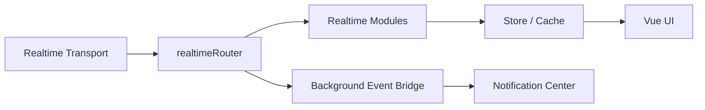

# Frontend Architecture

## Scope
Frontend (Vue/Vite) client. Responsible for UI, realtime ingress, E2EE operations, and local state.

## Key Responsibilities
- Maintain a single realtime ingress and route frames to active operation scopes.
- Orchestrate MLS (live) and CHK (history) crypto workflows.
- Enforce global and conversation crypto readiness gates in the UI.
- Emit background notifications independent of UI visibility.

## High-Level Flow

## Key Services and Entry Points
- Messenger orchestration: [`frontend/src/app/core/messaging/services/messenger.ts`](../../frontend/src/app/core/messaging/services/messenger.ts)
- Realtime router: [`frontend/src/app/core/messaging/services/realtimeRouter.ts`](../../frontend/src/app/core/messaging/services/realtimeRouter.ts)
- Transport clients: [`frontend/src/app/core/messaging/services/client/wsClient.ts`](../../frontend/src/app/core/messaging/services/client/wsClient.ts)
- Session gate (global crypto readiness): [`frontend/src/app/core/messaging/services/sessionGate.ts`](../../frontend/src/app/core/messaging/services/sessionGate.ts)
- Conversation key logic: [`frontend/src/app/core/messaging/services/messenger/conversationKeys.ts`](../../frontend/src/app/core/messaging/services/messenger/conversationKeys.ts)
- Background event bridge: [`frontend/src/app/core/messaging/services/messenger/backgroundEventBridge.ts`](../../frontend/src/app/core/messaging/services/messenger/backgroundEventBridge.ts)
- Notification delivery: [`frontend/src/app/core/messaging/services/messenger/notificationCenter.ts`](../../frontend/src/app/core/messaging/services/messenger/notificationCenter.ts)

## Scope Model
- UI scopes only represent visibility.
- Operation scopes control processing and network traffic.
- Operations activate operation scopes, not the UI.

Reference: [`docs/reference/scopes.md`](../reference/scopes.md)

## Crypto Gating
- Global gate (`crypto_ready`) blocks protected UI until vault is unlocked, device registered, and user key persisted.
- Conversation gate (`conversation_key_ready`) blocks per-conversation chat until CHK is available.

Reference: [`docs/states/README.md`](../states/README.md)

## Plugin Model
- Each plugin owns its domain state and commands.
- Plugins never instantiate their own websocket clients.
- UI components call plugin services, not the transport directly.

Reference: [`docs/plugins/plugin-standards.md`](../plugins/plugin-standards.md)

## Common Pitfalls
- Using UI scope to drive crypto or data fetches.
- Creating ad-hoc websocket listeners outside the router.
- Emitting notifications from UI-scoped modules.

## Related
- Realtime architecture standard: [`docs/architecture/realtime-architecture.md`](realtime-architecture.md)
- Workflows: [`docs/workflows/README.md`](../workflows/README.md)