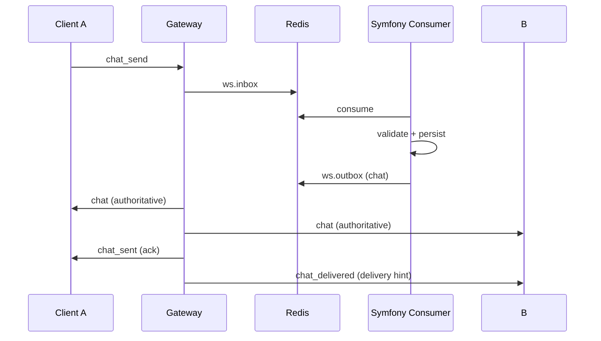

# Realtime Communication Architecture (Standard)

Status: Binding architecture standard for new features.
Scope: Frontend plugins, Gateway routing, Symfony realtime handlers, and event delivery back to frontend.

This document defines the **target standard** (Soll-Zustand). New features must follow this flow end-to-end.

References:
- `docs/reference/scopes.md` (frontend scope model)
- `docs/workflows/workflow-protocol.md` (live vs committed semantics)
- `gateway/rust-http3-gateway/src/routes.rs` (RoutingClass and MessageSemanticType)
- `gateway/rust-http3-gateway/src/project/command_registry.rs` (command registry and relay auth)

---

## 1) Frontend Plugin Model

### 1.1 Plugin Structure (Standard)
A frontend plugin is organized into:
- UI components (views, panels, modals)
- A **single domain service** responsible for outbound requests and inbound events
- Optional adapters to shared core messaging APIs
- No direct websocket usage; all realtime flows go through the central messenger ingress

### 1.2 Ownership Rules (Non-Negotiable)
Owners are the only modules allowed to mutate domain state and issue domain commands.

- Notifications: UI + feed + delegation only
- Calls: owner for call flow, MLS control conversation, media key exchange
- Chat: owner for conversation list, history, typing, read receipts, conversation MLS
- File-Transfer: owner for transfer flow and relay hotpath

### 1.3 UI-Scopes vs Operation-Scopes
- UI-scopes only reflect visibility
- Operation-scopes drive processing and network traffic
- UI-scopes never enable crypto or request data directly

See `docs/reference/scopes.md` for the definitive list of scopes and scope rules.

### 1.4 Allowed Requests / Responses per Plugin
- Each plugin may **send only commands/queries within its owned domain**
- Each plugin may **consume only events relevant to its owned domain and active scopes**
- Cross-domain data access is forbidden

### 1.5 Delegation Rules
- Notifications may emit `request_operation(...)` only
- Domain owners (chat/calls/file-transfer) activate operation-scopes and execute the flow
- Delegation is one-way; notifications never execute domain logic

### 1.6 Frontend Operation Dispatch (Explicit)
Operation requests are routed via exactly one dispatcher.

- Exactly one **operation dispatcher** exists in the frontend.
- All `request_operation(...)` calls go through this dispatcher.
- The dispatcher routes operations to the **owning plugin**.
- No ad-hoc cross-plugin event wiring is allowed.

### 1.7 Explicitly Forbidden
- Creating a parallel realtime ingress or websocket client
- Handling MLS or call control in notifications
- Loading full conversation history from list scope
- Global users or global presence in notification scope
- Deriving notifications from unrelated responses

---

## 2) Command / Query / Event Model

### 2.1 Definitions
- **Command**: Mutates server state or triggers a domain action
- **Query**: Requests data, does not mutate state
- **Event**: Server-to-client published domain fact
- **Signal**: Realtime control payload not persisted as domain truth

### 2.2 Naming Rules (Standard)
- Commands: `<domain>_<verb>`
- Queries: `<domain>_<noun>_request`
- Responses:
  - `*_ok` / `*_error` for request responses
  - `*_state`, `*_invited`, `*_committed` for authoritative events
  - Query results use stable domain naming: `messages`, `conversations`, `notifications` or `*_response`

### 2.3 Required Envelope Fields
- `type`
- `request_id` for commands/queries
- `conversation_id` or `call_session_id` when scoped
- `ts` or `ts_client`
- `message_id` when dedupe is required

---

## 3) Gateway Routing Model

Routing classes are defined in `gateway/rust-http3-gateway/src/routes.rs`.

### 3.1 Routing Classes
- `preauth`
- `gateway_local`
- `relay_hotpath`
- `backend_control`

### 3.2 Registry Requirements
Every new command must be registered with:
- `command_name`
- `routing_class`
- `message_type`
- `mirror_to_backend` (optional)

Relay commands must also be registered in:
- `RELAY_AUTHORIZATION_REGISTRY`

### 3.3 Targeting Rules
- **backend only**: BackendControl
- **self-targeted**: only for request responses and acks
- **targeted clients**: derived from domain membership or explicit relay context

---

## 4) Backend Realtime Model (Symfony)

### 4.1 Handler Layers
- MessageHandler Registry
- Action/Handler
- Use case / service
- Publisher

### 4.2 Ownership and Truth
- Symfony is the single source of truth for persisted state
- Gateway is transport and routing, not domain logic

### 4.3 Standard Response Patterns
- Commands: `*_ok` or `*_error`
- Queries: `messages` / `conversations` / `notifications` or `*_response`
- Updates: `*_state` or `*_updated`

---

## 5) Scope and Visibility Rules

Visibility is governed by operation scopes defined in `docs/reference/scopes.md`.

### Scope Rules (Summary)
- notifications scope: notification feed and invites only
- chat list scope: conversation summaries only
- conversation scope: messages, typing, read, attachments
- calls scope: call session state, control conversation, media keys

Any payload that exceeds a scope is a contract violation.

---

## 6) End-to-End Flow Example

---

## 7) Chat CHK Invite/Accept Standard

This is the binding rule for conversation history keys:

- Invite **pre-provisions** invitee-specific CHK wraps.
- Pending members **cannot** fetch keys.
- Accept returns the prepared wrap directly.
- If the wrap is missing at accept time, accept fails.

Related:
- `docs/crypto/chk.md`
- `docs/workflows/invite-accept.md`
- `docs/adr/adr-chk-invite-accept.md`
