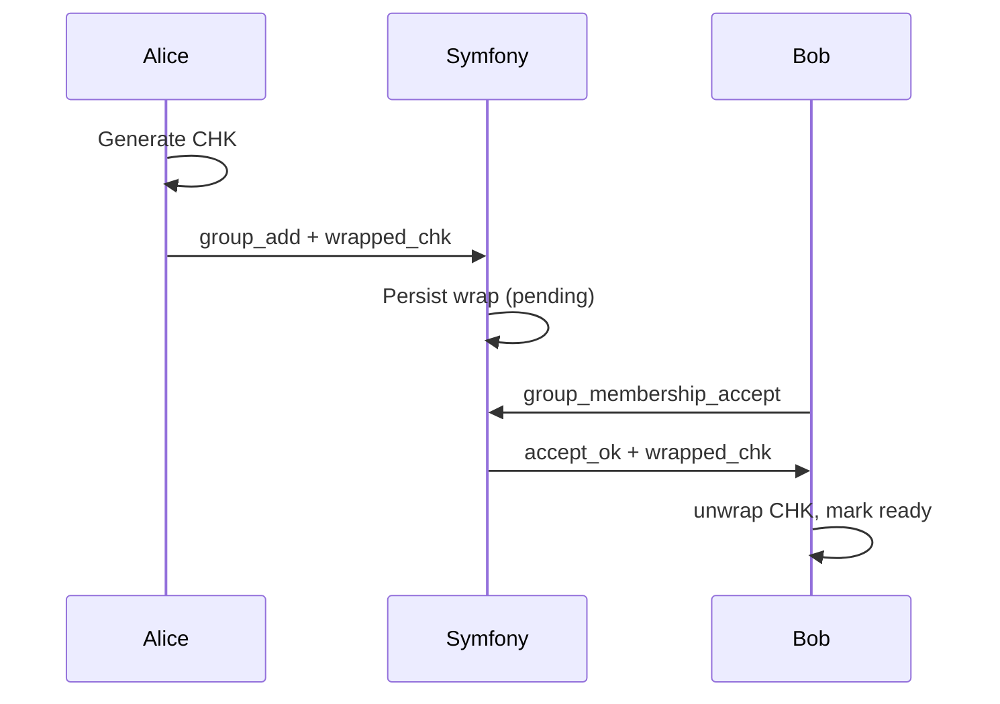

# CHK (Conversation History Key)

## Purpose
- Encrypts **history/storage** payloads.
- Separate from MLS (live transport).

## Core Rules
- CHK is generated client-side.
- Server stores only wrapped CHKs per member in `conversation_key_records`.
- Pending members cannot fetch CHK.

## Distribution Model (Current)
- Creator generates CHK in RAM.
- Creator pre-provisions a member-specific wrap at **invite time**.
- Accept response returns the prepared wrap.
- No post-accept fetch in the normal path.

## Sequence

## Storage Format
- `conversation_key_records` stores:
  - `conversation_id`
  - `user_id`
  - `wrap_alg`
  - `wrapped_chk`
  - `key_version`

## Recovery Path
- `conversation_key_fetch` exists for recovery only.
- Pending members are blocked.

## Related
- Wrapping: `docs/crypto/wrapping.md`
- ADR: `docs/adr/adr-chk-invite-accept.md`
- Invite flow: `docs/workflows/invite-accept.md`
