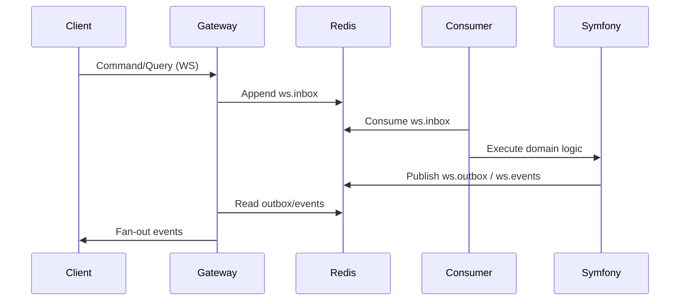

# Runtime Topology

This document describes the **runtime dataflow** and system topology.

## Realtime Dataflow (WebSocket default)

## Transport Modes
- WebSocket: default dev transport.
- WebTransport (HTTP/3): optional overlay.

The frontend uses a single transport abstraction. Only the gateway changes.

## Streams and Queues
- `ws.inbox`: inbound commands/queries.
- `ws.outbox`: outbound authoritative events.
- `ws.events`: system/aux events.

Redis is transport only. The database is the source of truth.

## Storage Flow
- Messages are stored encrypted (CHK) in MySQL.
- Attachments are stored as encrypted blobs; keys are wrapped and stored server-side.
- Server is not provided with storage key material and therefore cannot decrypt or unwrap storage keys.

## Services Required for Full Functionality
- `gateway`
- `symfony`
- `symfony-consumer`
- `redis`
- `mysql`
- `frontend`

If `symfony-consumer` is down, realtime commands will time out.

## Related
- [`docs/workflows/workflow-protocol.md`](../workflows/workflow-protocol.md)
- [`docs/architecture/realtime-architecture.md`](../architecture/realtime-architecture.md)
- [`docs/overview/system-behavior.md`](system-behavior.md)