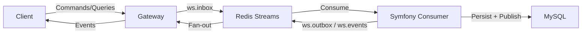

# System Overview

This document explains **what the system is** and how the major pieces fit together at a high level. It is the entry point for new contributors.

## System Goals
- End-to-end encrypted messaging and storage.
- Centralized, authoritative backend for membership and persistence.
- Thin, stateless gateway for realtime transport and routing.
- Clear separation between live transport security (MLS) and storage security (CHK).
- Multiple auth paths: password, identity (device-key), and WebAuthn (passkey).
- MLS uses **X‑Wing (X25519 + ML‑KEM‑768)** for post‑quantum key agreement.

## Components (High Level)
- **Frontend**: Vue/Vite client. Handles UI, E2EE, scopes, and local state.
- **Gateway**: Rust gateway. Routes realtime frames, enforces registry rules.
- **Backend (Symfony)**: Authoritative domain logic, persistence, and policy.
- **Redis Streams**: Realtime transport inbox/outbox/events.
- **MySQL**: Source of truth for persistent state.
- **Calls stack**: LiveKit + TURN for media streams.

## Source of Truth Rules
- Backend (Symfony) is the source of truth for domain state.
- Gateway is transport and routing only.
- Client is the source of truth for plaintext content and secret key material.

## Security Boundary (High Level)
- The server never sees plaintext CHK, MLS secrets, or vault secrets.
- The server stores only wrapped keys and ciphertexts.
- The server is not provided with key material and therefore cannot unwrap or decrypt client secrets.
- Clients decrypt locally and keep secrets RAM-only.

## High-Level Data Flow

## Key Invariants
- **Invite != access**, **accept = access** for conversation keys.
- Live transport uses MLS; storage uses CHK.
- UI visibility does not control crypto state or realtime processing.

## Where to Go Next
- Runtime topology: [`docs/overview/runtime-topology.md`](runtime-topology.md)
- Runtime behavior: [`docs/overview/system-behavior.md`](system-behavior.md)
- Realtime architecture standard: [`docs/architecture/realtime-architecture.md`](../architecture/realtime-architecture.md)
- Crypto overview: [`docs/crypto/crypto-overview.md`](../crypto/crypto-overview.md)
