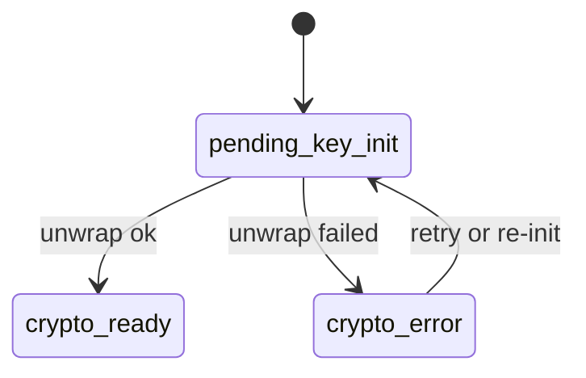

# State Matrix

This matrix separates **global readiness** from **conversation readiness**.

| Scope | State | Meaning | Trigger |
|---|---|---|---|
| Global | `crypto_ready` | Vault unlocked + user key ready + device registered | Vault unlock sequence completes |
| Conversation | `pending_key_init` | Waiting for CHK wrap/unwrap | Conversation opened without ready CHK |
| Conversation | `crypto_ready` | CHK available, history decryptable | Unwrap succeeded |
| Conversation | `crypto_error` | Key failure or missing wrap | Unwrap fails or accept returns no wrap |

## Diagram

## Related
- Global state: [`docs/states/global-crypto-ready.md`](global-crypto-ready.md)
- Conversation state: [`docs/states/conversation-crypto-ready.md`](conversation-crypto-ready.md)