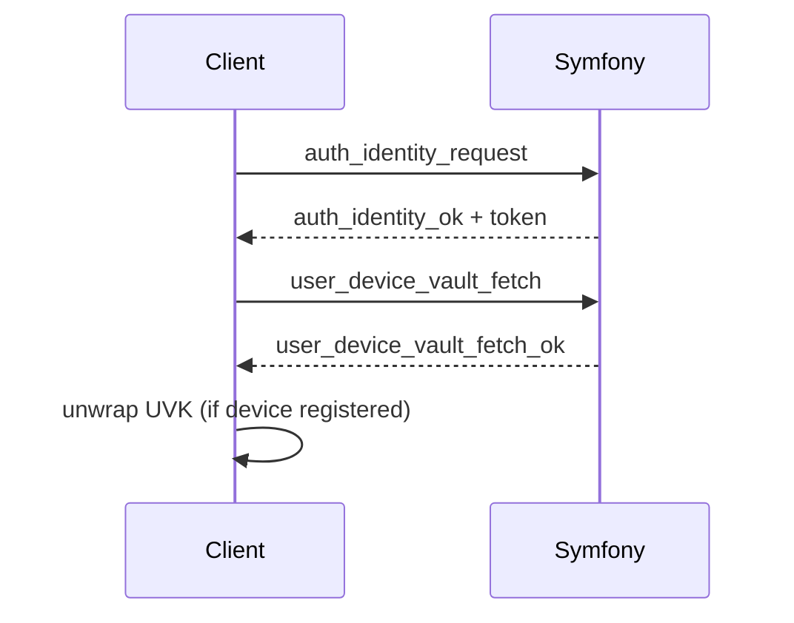

# Identity Signup / Signin

Identity auth is device-bound. Authentication and vault unlock are separate steps.

## Signin (Identity)
1. Client sends `auth_identity_request`.
2. Server returns JWT token.
3. Client fetches device vault (`user_device_vault_fetch`).
4. If `wrapped_uvk_for_device` exists, unwrap locally.
5. Global crypto readiness becomes true only after unlock.

## Notes
- Identity auth can succeed while vault remains locked.
- UI must remain gated until vault unlock completes.
- `user_vault_fetch` is **not** part of the normal identity flow (device vault is used).
 - Identity signup is not supported; use password or WebAuthn to create accounts, then sign in via IdentityAuth.

Related:
- [`docs/crypto/security-current.md`](../crypto/security-current.md)
- [`docs/states/global-crypto-ready.md`](../states/global-crypto-ready.md)
