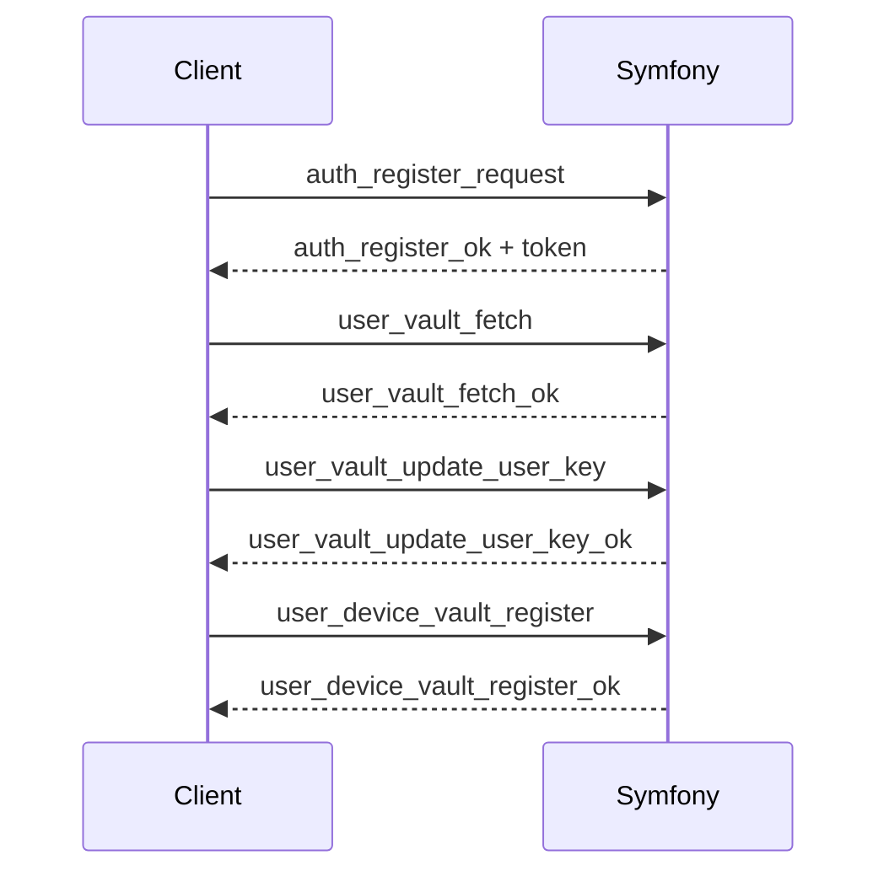

# Password Signup / Signin

## Signup (Password)
1. Client sends `auth_register_request`.
2. Server returns JWT token.
3. Client fetches vault (`user_vault_fetch`).
4. Client generates UVK and user key if missing.
5. Client persists user key (`user_vault_update_user_key`).
6. Client registers device vault (`user_device_vault_register`).
7. Global crypto readiness becomes true.

## Signin (Password)
1. Client sends `auth_login_request`.
2. Server returns JWT token.
3. Client fetches vault (`user_vault_fetch`).
4. Client unwraps UVK using password KDF.
5. Client ensures user key exists and is persisted.
6. Client registers device vault if needed.
7. Global crypto readiness becomes true.

## Notes
- Auth success does not imply crypto readiness.
- Vault unlock is mandatory before protected UI access.

Related:
- `docs/crypto/keys-and-vault.md`
- `docs/states/global-crypto-ready.md`
