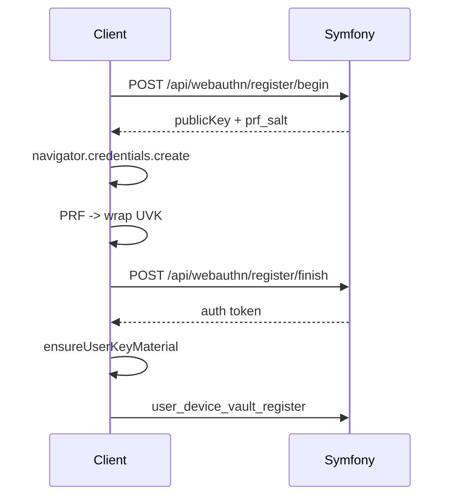
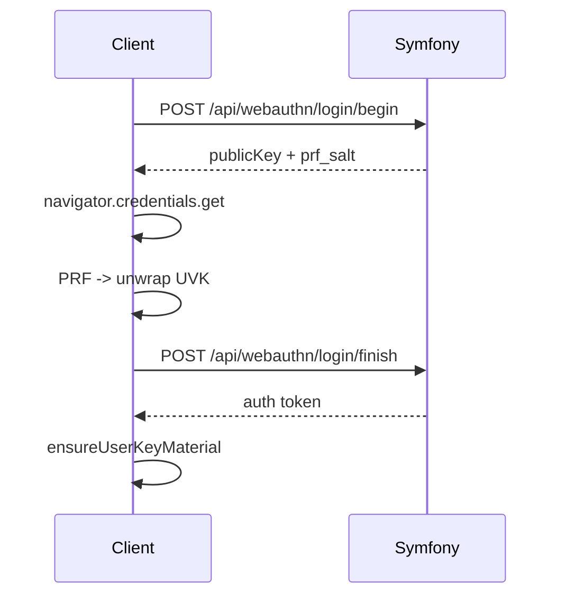

# WebAuthn Signup / Signin

WebAuthn is a **full‑value auth path** (like password and identity):
- It authenticates the user.
- It unlocks the vault locally via PRF.
- It continues the normal bootstrap (`ensureUserKeyMaterial`, `user_device_vault_register`).

## Signup (WebAuthn)
1. Client calls `POST /api/webauthn/register/begin` (email + display name).
2. Server returns `publicKey` options + `prf_salt`.
3. Client calls `navigator.credentials.create(...)`.
4. Client derives PRF output and wraps UVK locally.
5. Client sends credential + wrapped UVK via `POST /api/webauthn/register/finish`.
6. Server stores:
   - WebAuthn credential (`user_webauthn_credentials`)
   - UVK wrap + PRF salt (`user_webauthn_vaults`)
7. Server returns JWT token.
8. Client proceeds with vault bootstrap:
   - `ensureUserKeyMaterial(...)`
   - `user_device_vault_register`
9. Global crypto readiness becomes true.

## Signin (WebAuthn)
1. Client calls `POST /api/webauthn/login/begin` (email).
2. Server returns `publicKey` options + `prf_salt` for the selected credential.
3. Client calls `navigator.credentials.get(...)`.
4. Client derives PRF output and unwraps UVK locally.
5. If UVK unwrap **fails**, login is aborted and `login_finish` is **not** sent.
6. Client sends assertion via `POST /api/webauthn/login/finish`.
7. Server returns JWT token.
8. Client continues bootstrap and becomes crypto‑ready.

## Notes
- WebAuthn requires a **secure context** (HTTPS or localhost).
- PRF support is mandatory for this auth path.
- Each credential has exactly one UVK wrap (credential_id → wrapped_uvk).

Related:
- [`docs/crypto/keys-and-vault.md`](../crypto/keys-and-vault.md)
- [`docs/crypto/security-current.md`](../crypto/security-current.md)
- [`docs/states/global-crypto-ready.md`](../states/global-crypto-ready.md)
