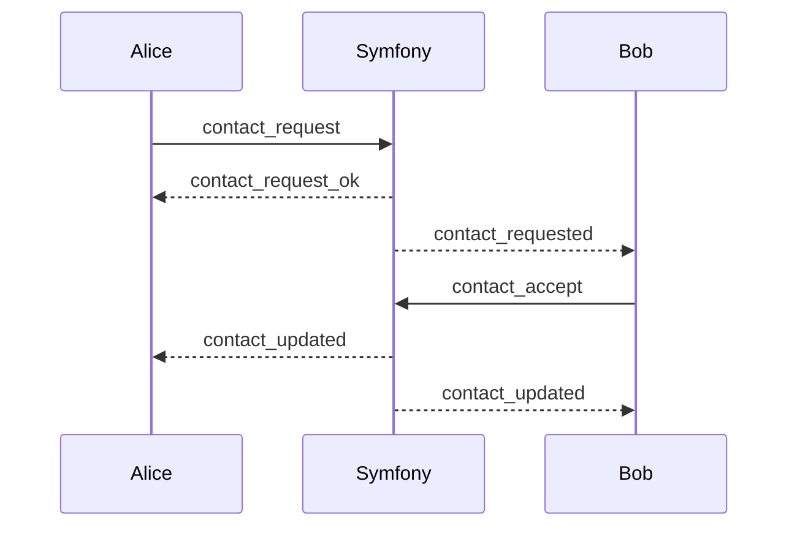

# Contact Request / Accept

Contacts define who appears in the user directory and who can be invited.

## Request
1. Client sends `contact_request`.
2. Server validates target user.
3. Server emits `contact_request_ok` and `contact_requested` event to the target.

## Accept
1. Target sends `contact_accept`.
2. Server activates contact status.
3. Both sides receive `contact_updated`.

## Notes
- Contacts are the intended user directory.
- Full tenant user listing is not exposed in normal UI flows.

Related:
- `docs/overview/system-behavior.md`
- `docs/reference/scopes.md`
