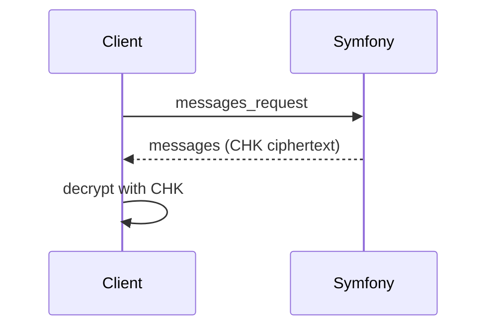

# History Reload

History reload depends on CHK being available.

## Flow
1. Client opens conversation.
2. Client ensures CHK is ready.
3. Client sends `messages_request`.
4. Server responds with encrypted history.
5. Client decrypts with CHK and renders messages.

## Notes
- If CHK is missing, UI remains in `pending_key_init`.
- CHK availability is conversation-specific.

Related:
- `docs/states/conversation-crypto-ready.md`
- `docs/crypto/chk.md`
