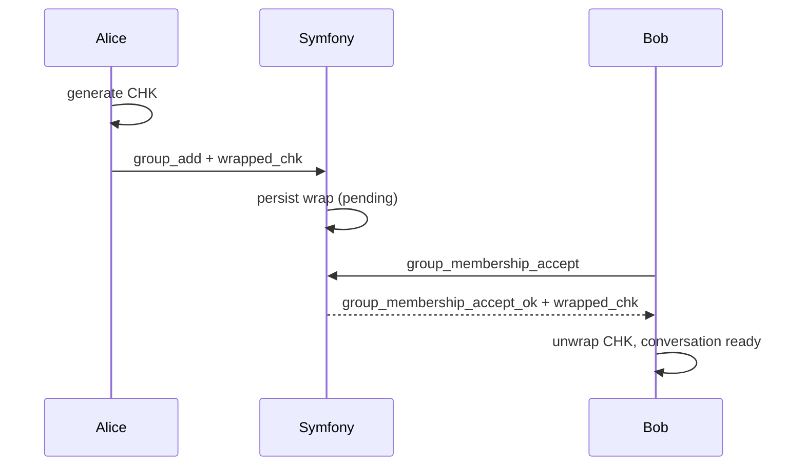

# Invite / Accept

This flow defines the **access boundary** and CHK delivery semantics.

## Invite (Create Wrap)
1. Creator generates CHK (if missing).
2. Creator builds a member-specific wrap using invitee `user_key_public`.
3. Creator sends `group_add` with `wrapped_chk`, `wrap_alg`, `key_version`.
4. Server persists the wrap in `conversation_key_records`.
5. Invitee remains **pending**.
6. MLS welcome/commit uses **X‑Wing (X25519 + ML‑KEM‑768)** for post‑quantum KEX.

## Accept (Access Boundary)
1. Invitee sends `group_membership_accept`.
2. Server activates membership.
3. Server returns the prepared wrap directly in the accept response.
4. Client unwraps CHK and marks conversation ready.

## Constraints
- Pending members cannot fetch CHK.
- Accept without wrap is a hard error.

Related:
- [`docs/crypto/chk.md`](../crypto/chk.md)
- [`docs/adr/adr-chk-invite-accept.md`](../adr/adr-chk-invite-accept.md)
