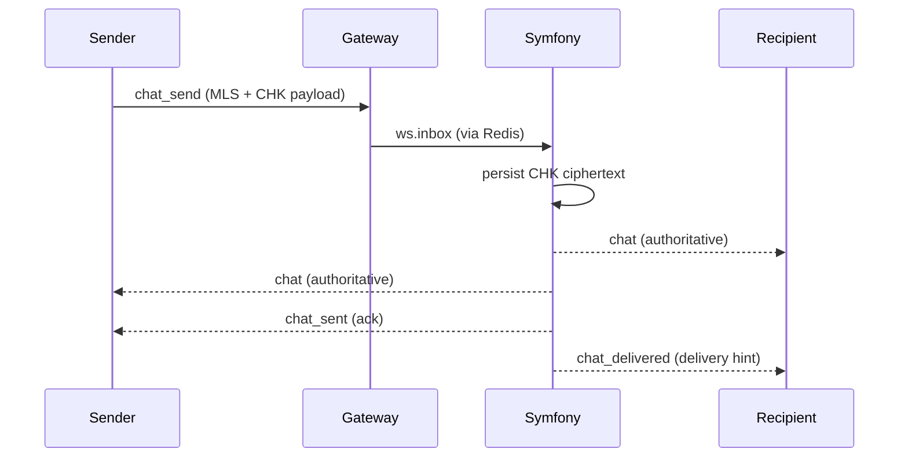

# Message Send / Receive

## Live + Storage Dual Encryption
1. Sender encrypts with MLS for live transport.
2. Sender encrypts with CHK for storage.
3. Gateway writes command to `ws.inbox` (no live fast path).
4. Symfony persists CHK ciphertext and publishes authoritative events.

## Notes
- Live display uses MLS only (from the authoritative `chat` event).
- History reload uses CHK only.
- Dedupe is `(conversation_id, message_id)`.

Related:
- `docs/workflows/workflow-protocol.md`
- `docs/crypto/crypto-overview.md`
