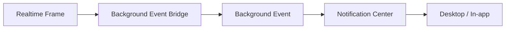

# Notifications (Active vs Inactive)

## Target Behavior
- Active conversation + focused app: no notification, live update only.
- Inactive conversation or app not focused: notification + unread update.

## Current Architecture
- Background Event Bridge (BEB) receives realtime frames globally.
- Adapters emit background events.
- Notification Center decides delivery (desktop, in-app, future push).

## Flow
1. Frame arrives via realtime router.
2. BEB adapter converts it into a background event.
3. Notification center dedupes and delivers if policy allows.

## Related
- `docs/architecture/frontend.md`
- `docs/overview/system-behavior.md`
