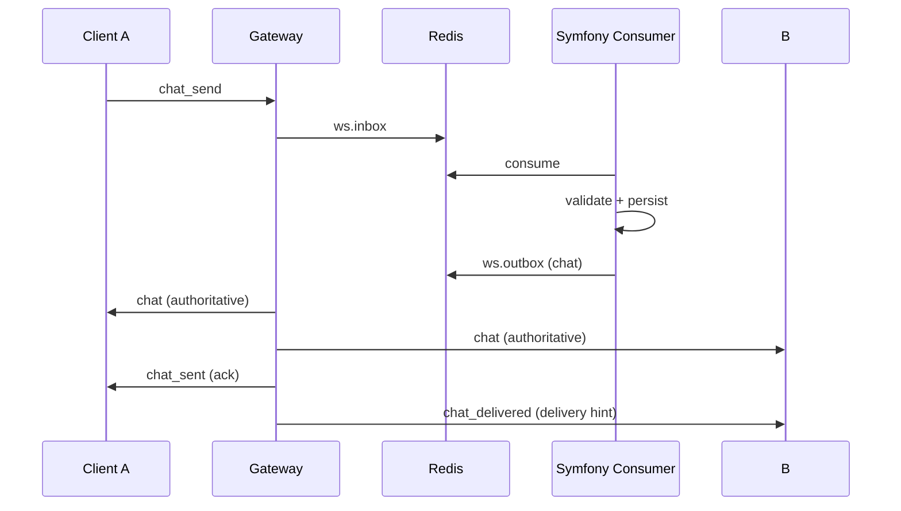

# Workflow Protocol (Authoritative Realtime)

Status: Current behavior
Scope: Client <-> Gateway <-> Symfony (WS/WT only, no client-HTTP)

## 1. Goal

The system is **authoritative-first**:

- Client sends commands to the gateway.
- Gateway writes into `ws.inbox`.
- Symfony consumer validates, persists, and publishes events.
- Clients render based on authoritative events.

There is **no fast-path live relay** in the current implementation.

## 2. Principles

- Gateway is transport + routing only.
- Symfony is the source of truth for persistence and state.
- Clients dedupe and apply events idempotently.

## 3. Terminology

- `message_id`: unique per message.
- `request_id`: request/response correlation.
- `conversation_id`: target conversation.

## 4. Current Event Model

### 4.1 Client -> Gateway (Command)
- `chat_send`
- `attachment_upload_*`
- `call_session_*`
- `group_*`

Required fields:
- `type`
- `request_id`
- `message_id` (for message-like payloads)
- `conversation_id` (if scoped)
- `ts_client`

### 4.2 Symfony -> Client (Authoritative)
- `chat` (authoritative message)
- `chat_sent` (sender ack)
- `chat_delivered` (delivery hint for online recipients)
- `state_*` (membership/history/call state)

## 5. Flow (Current)

## 6. Dedupe / Idempotency

- Dedupe key: `(conversation_id, message_id)`.
- Symfony enforces uniqueness per conversation.
- Gateway may deliver events at-least-once; client must dedupe.

## 7. Security

- Payload content remains E2E encrypted; gateway remains blind.
- Symfony performs ACL/membership checks before persistence.

## 8. Protocol Fields

Common fields:
- `type`
- `request_id` (commands/responses)
- `message_id` (message payloads)
- `conversation_id`
- `ts`

Important:
- Client commands do **not** include `subjects`.
- Subjects are resolved server-side.

## 9. Related
- `docs/architecture/realtime-architecture.md`
- `docs/workflows/message-send-receive.md`
